# What is OctoLEDSign?
This code supports an LED Matrix sign that reads information from Octoprint via [MQTT](https://mqtt.org/). The sign can display such things as the current operation (status), the extruder or bed temp, the filename, etc.   *Note: the LED panel/shelf displayed in the picture is a separate project and not part of the sign itself.*

#Video of sign in action#

[](https://youtu.be/m6aNKA-jmvc)

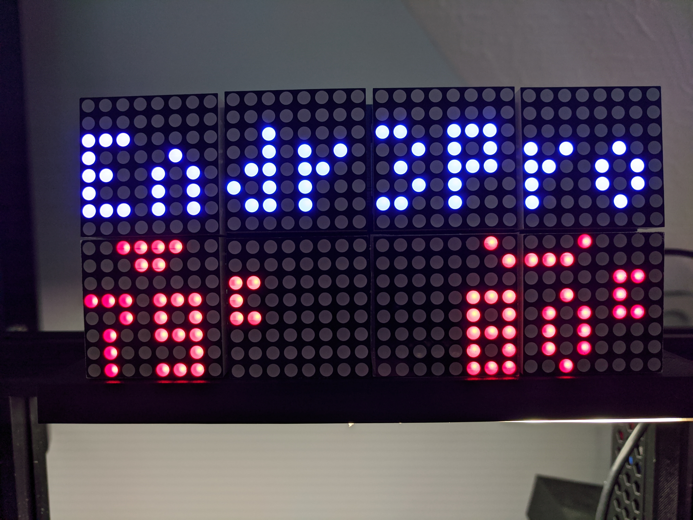
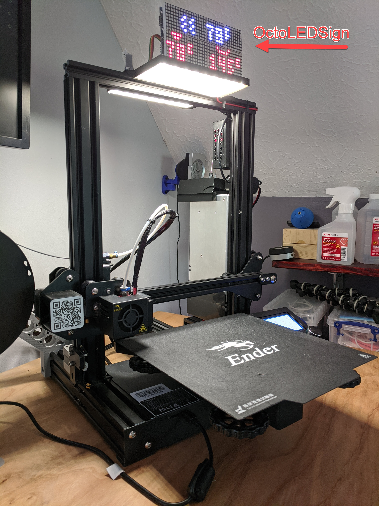

# What do you need?
For this code to be useful, you will need the items listed below. 

*Note: Some items listed have affiliate links where you can purchase the products. They might provide minor income to support this project and others like it at no cost to you.*

## Infrastructure
The setup and configuration of the required infrastructure is beyond the scope of this article.  However, the web is full of guides that can prove helpful. Google is your friend! And i have provided some links to help out.
- [Ender 3 Pro](https://amzn.to/3sp3RIh) You will need a 3d printer! I have setup the code to be very flexible about the type of printer, but it was targeted to an Ender3 (Pro). I can't say enough good about this little workhorse, especially for a beginner.  The `settings.json` file allows you to map fields to MQTT topics, so theoretically, anything that generates MQTT messages to feed the sign will work.
- You will want access to an MQTT server. 
    - For my purposes, I use [HomeAssistant](https://www.home-assistant.io/) setup with the Mosquito add-on. This is running on a dedicated raspberry-pi 3b+ and is working quite well.
- You will need [Octoprint](https://octoprint.org/) setup! For my purposes I have an octoprint server running on an old mac-mini running windows 10. The sign does not talk directly to OctoPrint. However, OctoPrint talks to the MQTT server (and the sign talks to the MQTT server).
- You will want the [Octoprint MQTT Plugin](https://plugins.octoprint.org/plugins/mqtt/) installed

## Hardware
- [Raspberry Pi Zero W](https://amzn.to/3tyssMa) (or better like [3b/3b+/4](https://amzn.to/3drVtTP)) with a power supply!
    - Install  **Raspberry Pi OS Lite 32 bit**. You do not need the overhead of the full desktop experience.
    - You can use the [Raspberry Pi Imager](https://www.raspberrypi.org/software/) to accomplish this.
    - Check the web for guides on installing the OS to your raspberry pi (it is beyond the scope of this article)

    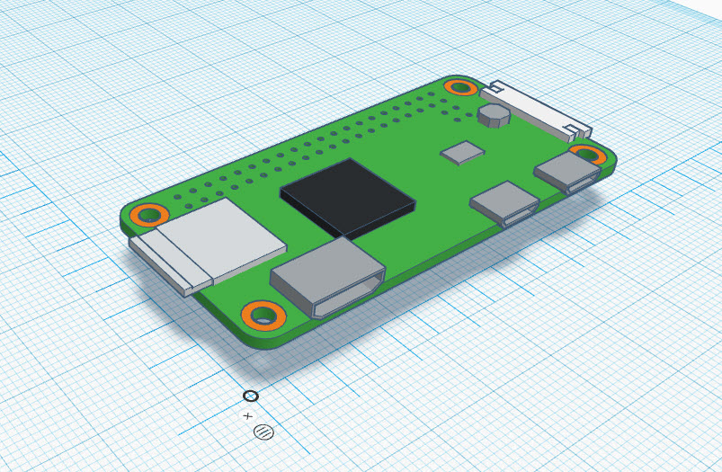


- A set of [max7219 x 4 matrix LED matrix displays](https://amzn.to/3ttKMpH).  I have purchased these from different vendors and there are indeed slight differences between them. Depending on the vendor, the boards used might vary in size by ~2mm.  This also slightly affects the alignment between each module in the 4-module strip. 

    *Note: You can daisy chaining multiples of these strips for a bigger sign, just update the `settings.json` file. In the base settings, it supports a sign made up of 2 of these strips; the top strip is blue and the bottom is red (each strip holds 4 arrrays, meaning 8 arrays total)*

    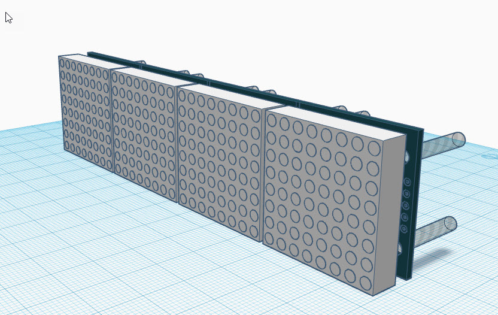 

- **Optional:** the following components are optional.
    - [DHT22 temperature and humidity sensor](https://amzn.to/32tgreZ). If you want to monitor the air temp around the printer, then by all means add one of these to the design.  The code provided also publishes this temperature the MQTT server (if the sensor exists).  Please note that sampling this DHT22 sensor takes about 0.5 seconds. This would produce a noticeable pause in animations, so the sampling rate was dialed back to once per minute (which is more than reasonable)
    
        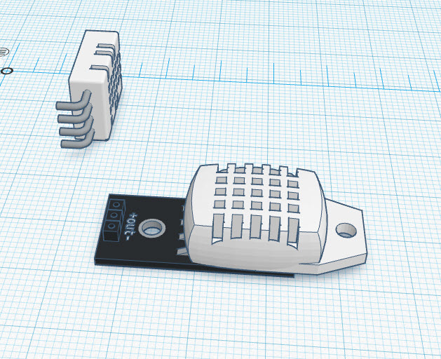 

    - [360 Degree Rotary Encoder](https://amzn.to/3gjnUFB) of your choice. This is used to control the display brightness on-the-fly, but you can eliminate this altogether if you want to set the brightness to a fixed value in the `settings.json` file.  I like these because they also act as a pushbutton switch by pressing the knob.
    
        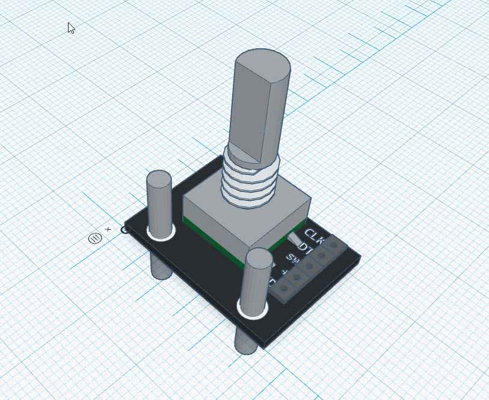 

### Wiring Up the Hardware
There are many ways to wire up these parts to the raspberry pi, but I have listed how I configured them below. If you google search, you will find in-depth instructions about each piece of hardware and how to wire them to the pi.  Consider what I present below as suggestions...

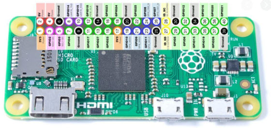

*Note: you may want/need to consolidate power and ground pins but I found this arrangement works fine*

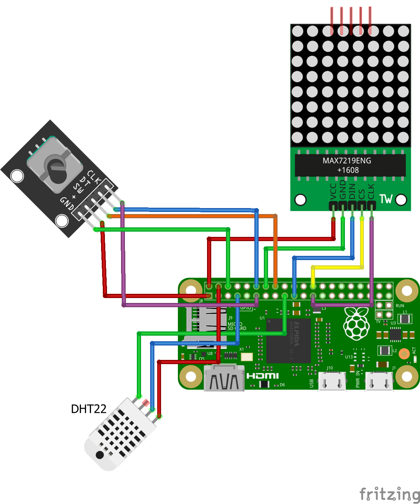

- Raspberry Pi to the LED Matrix
    | Raspberry Pi Zero | max7219 |
    | ------------------|---------|
    | Pin 2   (5V Power)| VCC     |
    | Pin 6   (Ground)  | GND     |
    | Pin 19  (GPIO 10) | DIN     |
    | Pin 24  (GPIO 8)  | CS      |
    | Pin 23  (GPIO 11) | CLK     |

- Raspberry Pi to DHT22
    | Raspberry Pi Zero | dht22   |
    | ------------------|---------|
    | Pin 4  (5V Power) | VCC (+) |
    | Pin 14 (Ground)   | GND (-) |
    | Pin 7  (GPIO 4)   | OUT     |

    In the `settings.json` file, this pin is reflected using GPIO numbering like this:
    ```
        "sensors": [
            {
                "name": "RoomTemp",
                "type": "22",
                "temperature": {...
                },
                "dht": {
                    "pin_data": 4       // GPIO4 is physical pin #7
                },
                "mqtt": {...
                }
            }
        ]
    ```

- Raspberry Pi to Rotary Encoder
    | Raspberry Pi Zero | Encoder |
    | ------------------|---------|
    | Pin 20  (Ground)  | GND     |
    | Pin 1   (3V Power)| (+)     |
    | Pin 16  (GPIO 23) | SW      |
    | Pin 12  (GPIO 18) | DT      |
    | Pin 11  (GPIO 17) | CLK     |

    In the `settings.json` file, these pins are reflected using GPIO numbering like this:
    ```
        "encoder": {
            "enabled": true,
            "pin_left": 17,         // GPIO17 is physical pin #11
            "pin_right": 18,        // GPIO18 is physical pin #12
            "pin_click": 23,        // GPIO23 is physical pin #16
            "sensitivity": 20
        },
    ```

# Installing Libraries
The requirements file will list all libraries, but here are some installation steps:
- **Paho-MQTT** - used for subscribing to MQTT notifications: 
`pip install paho-mqtt`
- **[Luma LED Libaries](https://luma-led-matrix.readthedocs.io/en/latest/install.html)** : make sure you **enable SPI on your device!**
    ```
    $ sudo usermod -a -G spi,gpio pi
    $ sudo apt install build-essential python3-dev python3-pip libfreetype6-dev libjpeg-dev libopenjp2-7 libtiff5
    $ sudo python3 -m pip install --upgrade luma.led_matrix
    ```
- **[Adafruit Circuit Python Library](https://learn.adafruit.com/circuitpython-on-raspberrypi-linux/installing-circuitpython-on-raspberry-pi)** - use for controlling a variety of devices and IO operations
    ```
    $ sudo pip3 install --upgrade adafruit-python-shell
    $ wget https://raw.githubusercontent.com/adafruit/Raspberry-Pi-Installer-Scripts/master/raspi-blinka.py
    $ sudo python3 raspi-blinka.py
    ```
- Next **[Install the CircuitPython DHT libraries](https://learn.adafruit.com/dht-humidity-sensing-on-raspberry-pi-with-gdocs-logging/python-setup)**
    ```
    $ pip3 install adafruit-circuitpython-dht
    $ sudo apt-get install libgpiod2
    ```
- Note: The above CircuitPython DHT libraries appear broken. The DHT always returns error with ["A full buffer was not returned" on raspberry pi Zero](https://github.com/adafruit/Adafruit_CircuitPython_DHT/issues/33).  However, using the deprecated (non-circuitpython) library works fine. Install it by [doing the following](https://learn.adafruit.com/adafruit-io-basics-temperature-and-humidity/python-setup):
    ```
    $ sudo pip3 install --upgrade setuptools
    $ sudo pip3 install Adafruit_DHT
    ```


# Cloning this repository
- open a terminal in your folder of choice ex: `~/octosign`
- run the following command:
    ```
    ~/octosign $ git clone https://github.com/nat1craft/OctoLEDSign
    ```

# Configuring the software
The first thing you need to do is configure your software. All of the configurable settings reside in `settings.json`.  Use your editor of choice like `$ sudo nano settings.json` or whatever makes you happy.
- **Wiring:** All of the hardware pins used to connect devices are specified here (see above wiring section for details). 
- **MQTT:** The MQTT server credentials are specificed in the section marked `mqtt_brokers`.  Enter the credentials used to access your mqtt server, including its ip address and port.
    ```
        "mqtt_brokers": [
            {
                "id": 0,
                "name": "Default MQTT Broker (i.e. Homeassistant)",
                "user": "**yourusername**",
                "password": "**yourpassword**",
                "host": "**yourhostip**",
                "port": 1883,
                "publish": {
                    "base_topic": "Octosign"
                }
            }
        ], 
    ```
- **LED Matrix:** You can configure the number and orientation of your LED matrices in this section.  For my setup, I had 2 strips of LEDs; Each strip composed of 4 LED matrices. This means `2 x 4 = 8` cascaded chips.
    ```
        "max7219": {
            "port": 0,
            "device": 0,
            "cascaded": 8, 
            "block_orientation":-90, 
            "blocks_arranged_in_reverse_order": false,
            "contrast": 0
        },
    ```

# Running the software
- open a terminal and change to your installation folder. example: `~/octosign`
- run the following command:
    ```
    ~/octosign $ sudo python3 app.py
    ```
- If you want to automatically run the software after the pi boots, perform the following:
    - Connect to the pi via SSH (if headless) or otherwise open a Terminal window
    - Edit crontab schedulle
    ```
    $ sudo crontab -e
    ```
    - add the following line to the bottom making sure to use the proper directory for your installation. This allows the sign app to run 20 seconds after bootup, which allows the wifi to connect before making MQTT calls.
    ```
    @reboot sleep 20 && sudo python3 /home/pi/octosign/app.py &
    ```
    - Hit `ctrl+x` and save
    - Reboot and the sign application should now run automatically
- If you installed the optional rotary encoder...
    - You may use it to dim/brighten the sign. You can adjust the sensitivity of the knob itself in the `settings.json` file. Basically the brightness goes from 0 to 255 and the sensitivity controls how much "per click" the brightness increments/decrements. 
    - Also, if you press-and-hold the encoder for 5 seconds and release, it will reboot the pi. 10 seconds will shut it down completely. (As I write this, I realize it would be nice to have a visual cue displayed on the sign for this. Future enhancement.)
- If you installed the optional DHT22 temperature sensor, you will see the room temp periodically displayed depending on the printer's status.


# Next Steps
- I plan to publish a 3d printable case for the sign here in the following weeks. I believe I have the initial design done, but it needs tweaks and testing before I can let it loose into the wild. If anyone is impatient (or I move on to other things), here is [a link to the tinkercad of my prototype](https://www.tinkercad.com/things/6jvwJisUWuB).  I need to work on where the front of the case slides between the LED PCB and the Matrix, and ensure the back is deep enough to fit over the encoder and still close tightly.  Here is what it looks like so far:

    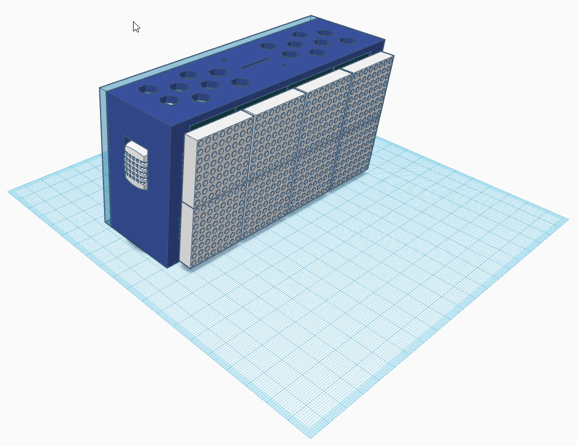
    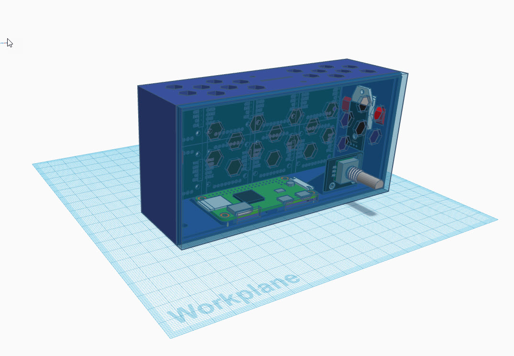
    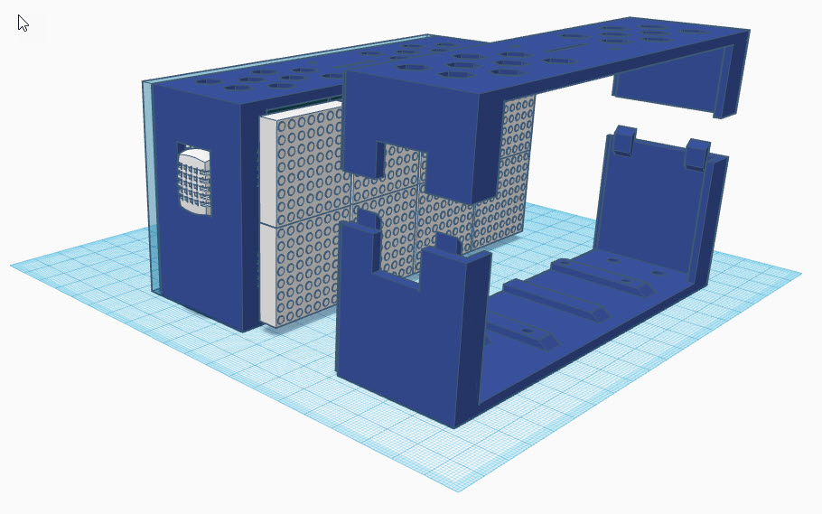

# Troubleshooting
- You will want a proper power supply since you are running both the raspberry pi and the LED matrices from the same power source.
- When wiring make sure you specify [GPIO number](https://www.raspberrypi.org/documentation/usage/gpio/) in the `settings.json` file for pin assignments.
- One helpful tip in determining "why is my printer not sending messages?" is to use your MQTT server's abilities to temporarily subscribe to a topic. Homeassistant has this capability buried in its bowels.
    - Go to **Configuration | Integrations** and click on the **Configure** link under the **MQTT** integration
    - Here you can **Listen to a topic**. Add the standard octoprint topic ```octoPrint/event/PrinterStateChanged``` and click **Start Listening**. You should see your printer's current state.  If not, check that your OctoPrint MQTT Plugin is working correctly.

# References
There are many articles on the web that explain the various processes and components used in this project. Some of the more helpful ones are as follows:
- [Installing Home Assistant](https://diyi0t.com/hass-io-raspberry-pi-setup-tutorial/)
- [Rotary Encoder for RPI](https://github.com/nstansby/rpi-rotary-encoder-python)
- [All about the max7219 LED chip](http://www.gammon.com.au/forum/?id=11516)
- [LUMA LED Matrix Libraries](https://luma-led-matrix.readthedocs.io/en/latest/install.html)
- [How to use PAHO MQTT](https://medium.com/python-point/mqtt-basics-with-python-examples-7c758e605d4)
- [OctoPrint List of States](https://docs.octoprint.org/en/master/modules/printer.html#octoprint.printer.PrinterInterface.get_state_id)